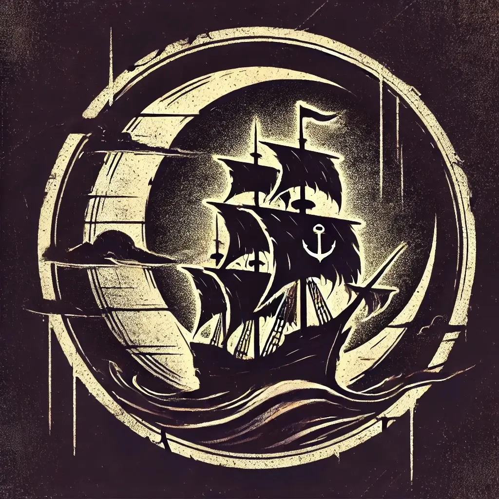

The Dusk is a powerful, semi-legal organization on [[../Places/Islands#**Asentra**|The Anchor]]. The guild operates both as an influential trade organization and network of covert operations. Their influence varies from organizing shipments of goods and controlling tariffs to engaging in smuggling and protection rackets. The Merchants of Dusk walk a thin line between legitimacy and crime. Their influence stretches from the Upper City's council to the Lower City's darkest alleys.

### **History and Origin**

The guild's roots can be traced back to the early days of The Anchor’s development as a trade hub. Initially formed by traders looking to protect their interests, the guild quickly grew into a powerful organization with both lawful and unlawful operations.
### **Structure**
The guild is composed of several interconnected branches, each overseeing different aspects of their activities, from political influence to illicit dealings. At the top is the **Guildmaster**, who serves as the leader and final decision-maker, representing the guild's interests in both legitimate commerce and criminal enterprise.
Both of those branches are overseer by the same person, the **Guildmaster**

#### **The Hushed** 
The Hushed is the secret branch of [[The Merchants of Dusk]], operation in the shadows of [[../Places/Islands#**Asentra**|The Anchor]]. This arm us responsible for the illegal's dealings of the guild, from smuggling to extortion and secret trade. They carry out operations silently, ensuring no trace of their work can be linked to the guild. 

1. **Pickpocket**: Entry-level members who perform petty theft and small-time cons to prove their worth.
2. **Footpad**: Trusted with gathering information, shadowing targets, and running errands for senior members, acting as the eyes and ears of The Hushed.
3. **Bandit**: Responsible for enforcing guild demands, including robbery and extortion, often through intimidation or force.
4. **Prowler**: Skilled nighttime thieves who handle high-value break-ins and assist in orchestrating heists.
5. **Cat Burglar**: Experts in high-risk thefts, targeting secure locations and handling valuable items.
6. **Shadowfoot**: Elite operatives leading crews in complex missions, including smuggling and assassination, with significant autonomy.
7. **Master Thief**: High-ranking operatives overseeing multiple crews and serving as intermediaries between the Council of Shadows and field operatives.
8. **Council of Shadows**: The strategic leaders of The Hushed, including trusted figures, who make key decisions and set long-term objectives for the guild.

#### Activities
- Smuggling goods, including contraband.
- Protection rackets targeting businesses in the Lower City.
- Extortion, black market deals, and other covert activities.

#### **The Guild of Voices**
The Guild of Voices is the legitimate front of the Merchants of Dusk, handling all lawful aspects of the guild’s operating openly within the political and economic spheres of the Anchor. This branch is involved in the council of the [[../Places/Islands#**Asentra**|Anchor]], organizing trade, managing alliances, and acting as intermediaries in major economic deals in the island. Members using their influence to ensure that the Merchants of Dusk remain an essential part of the Anchor's commerce and governance.

1. **Trader**: The foundational members of the Guild of Voices, representing merchants and small business owners in the guild. They handle day-to-day trading and establish connections across the Anchor.
2. **Merchant Representative**: Elevated members who advocate for the interests of Traders within the Guild and serve as contact between local traders and the upper ranks of the guild.
3. **Trade Negotiator**: Skilled negotiators responsible for setting up trade agreements and expanding the Guild's network, often mediating disputes between Traders or securing favorable trade deals.
4. **Market Overseer**: Supervisors of specific markets or districts, ensuring all traders adhere to guild guidelines, settling disputes, and maintaining harmony and profitability in their respective areas.
5. **Council Member**: Experienced nobles who sits on the **Council of Acentra**, the governing organization of the Anchor. They act as a political party, prompting the guild interests in the island.
6. **Council of Trade**: The strategic leaders of The Guild of Voices, including trusted figures, who make key decisions and set long-term objectives for the guild.
#### Activities
- Organizing and overseeing trade within The Anchor.
- Acting as intermediaries in major economic agreements.
- Managing tariffs, controlling shipment schedules, and ensuring fair trading practices in the island.
- Representing the merchants in the island council.

### **Influence**
#### **Economic Influence**
The Merchants of Dusk control the trade on The Anchor, including tariffs, shipping routes, and market prices. Their economic influence is strong enough to affect the stability of the island’s economy.

#### **Political Influence**
The guild maintains significant political influence, especially in the Upper City. Members of the Guild of Voices are part of The Anchor’s council, shaping policies to benefit the guild's interests.

#### **Control of the Underworld**
The Hushed maintains control of the Anchor's underworld, managing smuggling operations, underground trade, and coercion tactics to ensure dominance in illegal dealings.

